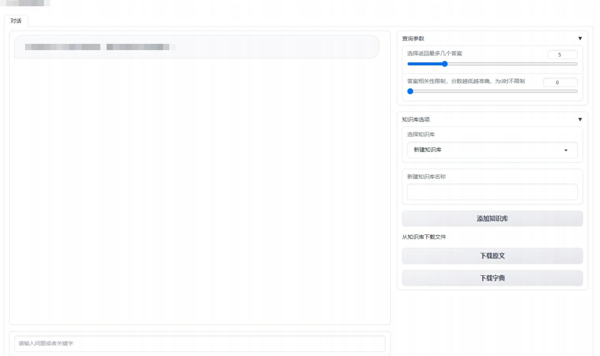

# 基于langchain和OpenAI Api的本地知识库搭建

## 介绍

🤖️ 一种利用 [langchain](https://github.com/hwchase17/langchain) 思想实现的基于本地知识库的资料检索应用，目标是针对准备好的QA文档，实现一套至少回答部分离线的知识库检索方案。

💡 受 [imClumsyPanda](https://github.com/imClumsyPanda) 的项目 [langchain-ChatGLM](https://github.com/imClumsyPanda/langchain-ChatGLM) 启发，选择不再使用离线部署的LLM模型，亦不再试图润色上下文再做回答，直接检索到内容予以反馈。

✅ 本项目中 Embedding 默认选用的是 [GanymedeNil/text2vec-large-chinese](https://huggingface.co/GanymedeNil/text2vec-large-chinese/tree/main)。

⛓️ 本项目实现原理为，加载QA文档 -> 提取问题答案集 -> 问题部分提交OpenAI API生成同义句 -> 问题和答案组成字典匹配 -> 问题向量化FAISS储存 -> 在文本向量中匹配出与问句向量最相似的`top k`个 -> 合并同义句问题产生的答案 -> 返回用户。

🚩 本项目没有微调、训练过程，直接使用OpenAI API（默认GPT-3.5）进行同义句生成。

## 开发部署

### 软件需求

本项目开发时环境为Python 3.8.10 + torch 2.0.1。

### 1. 安装环境

torch请从官网进行下载。

```
pip install -r requirements.txt
```

下载nginx。

### 2. 配置

在model_config.py的最前方，`敏感配置`部分内配置OpenAI账户里得到的OpenAI Key和Gradio将使用的服务器设置。

ChatGPT Plus用户每月有5美元的免费额度。

另外，请修改nginx的配置，将访问指向content文件夹：

```
    server {
        listen       80;
        server_name  localhost;
        charset utf-8;

        #使用utf-8字符集防止中文乱码

        #access_log  logs/host.access.log  main;

        location / {
            autoindex on;
            root   ../content;
        }
        #访问指向content文件夹
        #打开autoindex以便列出所有文件下载
```

### 3. 执行脚本体验 Web UI

```shell
python webui.py
```

### 4. 启动nginx

启动nginx目录下的nginx.exe。

nginx.exe的功能是提供下载和图片的http服务。

### 5. 启动uvicorn

修改目录下的api_run.bat并运行。

该批处理的功能是用于提供网页API服务，确保API面向的用户不能查看、下载、修改数据库。

### 6. 建立本地知识库



#### 检索

选择知识库，直接提问即可。

如果介意答案相关性，可以将相关性分数设置为500左右。

#### 新建和更新知识库

从知识库中下载原文或字典，或自行准备原文或字典。

原文指如下格式的QA文档：

> Q:这里是问题？
>
> A:这里是答案！

字典指如下格式的Json文件，后缀名为"*.dict"，如果是机密数据，须使用这种方式人工制作同义句数据。因为字典不会走请求同义句的流程，故不会外泄信息：

> {
>     "原始问题1" : {
>         "answer" : "答案",
>         "synonymous" : [
>             "原始问题1的同义句1",
>             "原始问题1的同义句2",
>             "原始问题1的同义句3",
>             "原始问题1的同义句4"
>         ]
>     }, 
>     "原始问题2" : {
>         "answer" : "答案",
>         "synonymous" : [
>             "原始问题1的同义句1",
>             "原始问题1的同义句2",
>             "原始问题1的同义句3",
>             "原始问题1的同义句4"
>         ]
>     }
> }

在答案中插入链接的方法是：

> \<a href="https://www.baidu.com">标题名</a>

在答案中插入图片的方法是：

> \img src='http://{ip}:{nginx_port}/img/{kb_name}/图片名.jpg'/>

选择或新建知识库后，上传字典或者原文及图片即可。由于每次提交API产生同义句需要一定时间，故大文档的时间可能很久。

### 7. 网页API

使用网页API的方法参见目录下的query_answer.py。

网页API可供受限制用户使用。

## 路径相关

- QA文档上传后储存在content\docs\\{知识库名}文件夹下；
- QA文档产生的字典储存在content\dicts\\{知识库名}文件夹下；
- 图片上传后储存在content\img\\{知识库名}文件夹下；
- QA文档产生的向量集合储存在vector_store\{知识库名的拼音}文件夹下；

## 路线图

- [ ] 命令行形式应用
- [x] 接口和相关文档
- [x] 展示知识库内所有文档下载
- [x] 提供对同义句的修订
- [x] 支持图像和链接